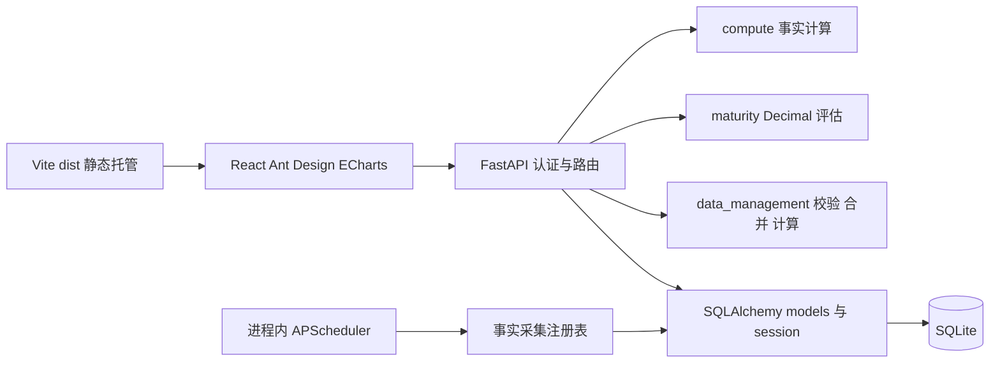

# Current Architecture

## 边界与技术栈

一个 React 19 客户端和一个 FastAPI 服务；Ant Design 提供 UI，ECharts 提供图表，React Router 管理页面。SQLAlchemy 2 管理默认 SQLite 存储，Pydantic 校验 HTTP DTO，APScheduler 3 在服务进程内调度。没有消息队列、独立采集服务或已联调平台连接。

路由查询数据库后交给计算函数，不由图表决定统计口径。源数据 API 编排校验、权限和事务。调度器仍使用事实注册表；源数据注册表挂在 app state，仅有接口预留。图中的采集关系代表代码路径，不代表真实数据源已接通。

## 核心模块与依赖方向

| 模块 | 职责 | 约束 |
|---|---|---|
| `main.py` | 组装中间件、路由、lifespan、静态托管 | 启动和关闭调度器 |
| `auth.py` | session、密码及角色/团队权限 | 后端授权，每次加载用户 |
| `api.py` | 认证、目录、事实、成熟度 | 调用纯计算和 ORM |
| `data_api.py` | 组织、IR、批次、源数据指标 | 复用 data_management 规则 |
| `compute.py` / `maturity.py` | 事实和评估计算 | 不依赖 HTTP 或数据库查询 |
| `data_management.py` | IR 规范化、解析、差异、合并和指标 | 不承担 HTTP 编排 |
| `models.py` / `db.py` / `migrations.py` | 实体、session、现有库增量 schema | 没有通用迁移框架 |
| `collectors.py` / `scheduler.py` | 接口注册和定时事实采集 | 没有真实平台实现 |

客户端共用 `api.js` 的 `fetchJson` 携带 cookie 和统一 HTTP 异常；领域页面拆出逻辑和图表配置。当前路径由 `routing/routeMetadata.js` 定义：`/`、`/analytics/teams/:teamId`、`/analytics/metrics/:metricId`、`/data/ir`、`/settings/*`；旧路径保留重定向。

AppShell 分别持有桌面折叠选择、matchMedia 窄屏状态与抽屉开关。localStorage 的 ai-dev-radar.sidebar-collapsed 只保存桌面布尔偏好；读取失败默认展开，写入失败不影响使用。监听 680px 断点，变化时关闭抽屉并恢复独立桌面选择。桌面 CSS 同步 248px/64px 导航宽度与正文偏移；窄屏使用现有 Ant Design Drawer，不保留图标栏，关闭后焦点返回顶栏打开按钮。AppSidebar 复用角色过滤与路由元数据，原生 details 显示默认关闭的未开放入口，图标模式隐藏该组。总览及其下钻使用所属入口样式，精确匹配才使用 aria-current=page。导航独立滚动，切换不发业务请求、不改变路由和权限。

## 数据流和模型

事实链路：FactRecord → 当前有效事实选择 → 周/月或迭代切片 → 团队序列、全公司均值和领域合并值。IR 链路：输入 → 临时批次/手工保存 → 正式 IR 与审计 → `/api/data-metrics/compute`。成熟度链路：团队月度维护 → MaturityRecord → Decimal 领域聚合。三者独立，IR 不自动替换看板事实。

团队产品层级支持源数据归属；人员关联责任工号。旧 ProductVersion 可无 product_id 是兼容形态，新管理版本必须绑定产品。更多模块细节见 [源数据模块](modules/data-management.md)。

## 运行与部署

lifespan 依次建表、增量 schema、检查活动目录并在为空时播种，随后启动调度器，关闭时等待调度器退出。播种是否执行由目录是否为空决定，不能据此宣称所有缺失数据都会自动补齐。

本地 Vite 将 `/api` 代理到 8000 后端。Docker 多阶段构建 Vite，FastAPI 同源托管 dist，以单个 Uvicorn 进程启动，SQLite 放在 `/data` 卷。SPA fallback 仅处理无扩展名 GET 客户端路径，显式排除 `/api`，保留 API 404/405 语义。环境变量详见 [README](../../README.md)。

进程内调度约束意味着扩展多 worker 会重复调度；当前部署采用单进程。生产配置拒绝默认密钥和种子密码，HTTPS 场景需启用 secure cookie。Docker 镜像、卷重启持久化、MySQL 与真实平台采集本次未运行验证，不应宣称已验收。
