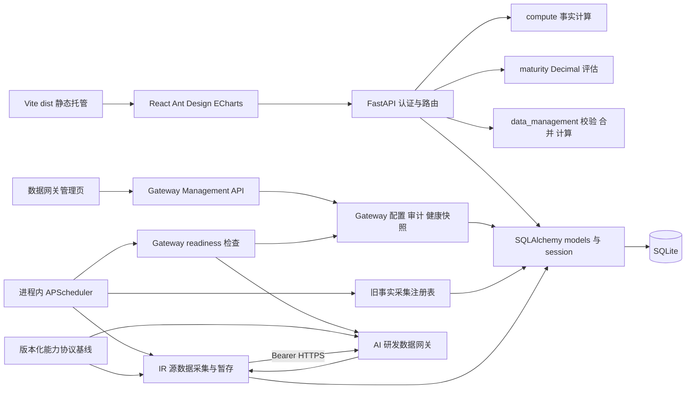

# Current Architecture

## 边界与技术栈

一个 React 19 客户端和一个 FastAPI 服务；Ant Design 提供 UI，ECharts 提供图表，React Router 管理页面。SQLAlchemy 2 管理默认 SQLite 存储，Pydantic 校验 HTTP DTO，APScheduler 3 在服务进程内调度。Radar 通过同步 HTTPX 客户端调用 AI 研发数据网关；Gateway 源码不在本仓库，当前实现仅覆盖 IR。双方共同依赖版本化能力协议，Radar Pydantic 模型只是消费端实现。

路由查询数据库后交给计算函数，不由图表决定统计口径。源数据 API 编排校验、权限和事务。旧事实采集仍走 FactRecord 注册表；IR 源采集由 `source_collection.py` 读取一次 Active 配置形成不可变快照，经 AI 研发数据网关执行并写入暂存批次，不触碰正式 IR 或旧事实链路。配置、最新健康状态和配置审计由 Gateway 管理模块持久化；健康检查与采集复用同一个进程内 APScheduler。协议工作区保存最新完整基线和逐版本变化，消费者固定发布 tag 或 commit。图中的 Gateway 关系代表 Radar 侧实现，不代表真实内部平台联调已通过。

## 核心模块与依赖方向

| 模块 | 职责 | 约束 |
|---|---|---|
| `main.py` | 组装中间件、路由、lifespan、静态托管 | 启动和关闭调度器 |
| `auth.py` | session、密码及角色/团队权限 | 后端授权，每次加载用户 |
| `api.py` | 认证、目录、事实、成熟度 | 调用纯计算和 ORM |
| `schemas.py` | HTTP 请求/响应 Pydantic DTO | `ComputePointOut.fact_count` 标出各团队周期事实数，响应用它区分缺失与记录值 0 |
| `data_api.py` | 组织、IR、批次、源数据指标 | 复用 data_management 规则 |
| `gateway_api.py` / `gateway_config.py` | 管理 Active/Draft、实时激活、配置审计和 CollectionRun runtime snapshot | admin-only；Token 不进入读取响应、审计、run 或日志 |
| `gateway_health.py` | readiness 状态转换、最新状态持久化、stale 判定及立即/周期检查 | 复用 APScheduler；每 30 秒检查 Active；不保留时序 |
| `source_collection.py` / `collector_gateway.py` | IR 周期窗口、按团队运行、显式 runtime snapshot 的 Gateway HTTPS 调用及暂存 | 同一 CollectionRun 所有团队共用一份快照；不自动重试 |
| `gateway_contracts.py` / `collector_contracts.py` | Readiness 与 IR 的严格 Pydantic 消费端模型 | 与版本化 OpenAPI 基线做一致性测试 |
| `ir_imports.py` | 文件导入与采集共用 IR 行校验及批次创建 | 采集批次必须绑定团队 |
| `compute.py` / `maturity.py` | 事实和评估计算 | 不依赖 HTTP 或数据库查询 |
| `data_management.py` | IR 规范化、解析、差异、合并和指标 | 不承担 HTTP 编排 |
| `models.py` / `db.py` / `migrations.py` | 实体、session、现有库增量 schema | 没有通用迁移框架 |
| `collectors.py` / `scheduler.py` | 接口注册、定时事实采集及配置化源数据采集 | Gateway 健康任务沿用同一个 Scheduler；没有真实平台实现 |

客户端共用 `api.js` 的 `fetchJson` 携带 cookie 和统一 HTTP 异常；领域页面拆出逻辑和图表配置。当前路径由 `routing/routeMetadata.js` 定义：`/`、`/analytics/activities`、`/analytics/capabilities`、`/analytics/teams/:teamId`、`/analytics/metrics/:metricId`、`/data/requirements/:requirementType`、`/data/maturity`、`/data/{issues|mr|code-review}`、`/settings/*`（含管理员 `/settings/collections` 与 `/settings/gateway`）；旧数据管理路径重定向到新分类，旧 `/?category=key|general` 重定向到活动/能力页。

AppShell 分别持有桌面折叠选择、matchMedia 窄屏状态与抽屉开关。localStorage 的 ai-dev-radar.sidebar-collapsed 只保存桌面布尔偏好；读取失败默认展开，写入失败不影响使用。监听 680px 断点，变化时关闭抽屉并恢复独立桌面选择。桌面 CSS 用同一自定义宽度变量同步 248px/64px 侧栏宽度与正文左偏移，并以 240ms cubic-bezier(.2,0,0,1) 过渡；首屏直接使用保存状态，连续切换由 CSS 从当前动画位置反向过渡，prefers-reduced-motion: reduce 时禁用新增过渡。Topbar 是 56px 的 Breadcrumb 与账户操作区，不承载路由页面标题。

AppShell 在主要内容区内捕获 lazy route 的 Suspense，以 `ContentLoadingState` 加载页面模块时保留导航和 Topbar。`frontend/src/components/StatusPage.jsx` 提供共享 403、404、pending、fatal-error 页面及内容加载状态。`App.jsx` 在认证服务确认用户前独立展示认证加载状态；登录页、401 重新认证和返回中断路径仍由 App 管理，不新增 token refresh。

AppShell 按路由给内容区标记 dashboard、analytics、operational 或 readable 模式。Dashboard/Analytics 使用侧栏后的 fluid canvas 和 24px–40px gutter；需求和大多数系统管理路由（包括数据采集）使用 1600px Operational 表格/工作流宽度；`/settings/gateway` 使用上限 1120px 的 Readable 配置画布。`.app-shell__content` 只裁切横向溢出（`overflow-x: clip`），不建立纵向滚动容器；Analytics 文档由浏览器负责纵向滚动，活动目录与能力结构导航以 sticky 定位在 Topbar 下方。Sidebar 的固定定位与内部导航滚动仍独立。

`frontend/src/design/tokens.css` 是 light mode 的运行时语义 token 源，涵盖基础 Surface、状态、团队系列、benchmark、成熟度色阶、排版、间距和控制高度。`design-system.css` 持有滚动条、全局排版/网格、PageHeader/FilterToolbar、Analytics primitives、状态及 Operational workspace 样式；`theme.js` 将语义色、字体、间距和控制高度映射到 Ant Design，`charts/chartTheme.js` 为 ECharts 读取同一数据可视化 token。应用和页面 CSS 直接消费 canonical tokens，`app.css` 只保留 `--shell-sidebar-width` 这类真实壳层状态，不再提供兼容色值别名。`components/PageHeader.jsx`、`FilterToolbar.jsx`、`MetricCard.jsx` 和 `AnalyticsComponents.jsx` 只负责呈现，不拥有领域/API 状态；后者提供 `AnalyticsSection`、`ChartCard`、`BenchmarkLegend`、`AnalyticsDirectory`、`MaturityMatrix` 和 `TeamMatrix`。`FocusRestoringDrawer.jsx` 包装 Ant Design Drawer，在保留模态与键盘行为的同时把关闭后的焦点还给触发操作；移动导航 Drawer 仍由 AppShell 显式恢复打开按钮焦点。`StatusPage.jsx` 提供共享状态组件，ECharts 业务映射仍由对应图表选项文件负责。`premium-ui.json` 为 UI 静态审计声明产品配置和已接受的原生 Select/Listbox、Date 控件归属。AnalyticsPages、DataManagement、AppShell 与 TeamDrilldown 的运行时 CSS 使用语义 tokens；指标详情共享 Analytics 图表样式。DataManagementPage 的 IR 表把 `FilterToolbar` 放在 Table 之前，并由 Table 自己处理 sticky header/局部横向滚动；团队、产品、指标管理复用 shared settings workspace，成熟度和 IR 页面布局仍留在 `dataManagement.css`。UsersSettingsPage、CollectionsSettingsPage 和数据管理各主工作区复用 PageHeader；用户权限使用 operational table，采集设置使用摘要、section 和可展开运行历史。登录页继续由 App 拥有认证请求，使用 `noValidate`、字段 ARIA 关联和表单内错误；认证失败不向用户暴露原始服务错误。App 监听路由路径并为登录、洞察、数据管理和系统管理页面设置本地化 `document.title`。

AppSidebar 的品牌区放共享的 frontend/public/favicon.svg 雷达 Logo 和折叠按钮：展开时水平分列，折叠后垂直居中；展开态使用 MenuFoldOutlined 收起侧栏，折叠态使用 MenuOutlined，按钮保留 Tooltip、ARIA 标签及键盘焦点反馈。按钮为 40×40px，hover 缩放 1.06、active 缩放 0.94，颜色/背景/缩放过渡 160ms；prefers-reduced-motion: reduce 时关闭按钮过渡和缩放。共享 SVG 为蓝色圆形雷达环、实色青色扫描线和三个数据点，供侧栏、抽屉、登录页和 favicon 使用。中间 app-nav 独立滚动，文字使用透明度与最大宽度裁切保持单行。窄屏使用现有 Ant Design Drawer，抽屉和侧栏共用 #F8FAFD 浅色表面，不保留折叠图标栏，关闭后由 AppShell 恢复顶栏打开按钮焦点，避免过渡期间与 Ant Design 默认恢复时机竞争。AppSidebar 复用角色过滤与路由元数据，数据管理直接提供四类来源链接，需求子路由共享所属入口样式；总览及其下钻同样使用所属入口样式，精确匹配才使用 aria-current=page。折叠切换不发业务请求、不改变权限。

`AnalyticsPages` 将研发总览、研发活动和研发能力拆成三个同级只读页面，以 URL `month` 作为共同分析月份。总览按 `cycle`（近六个月/本半年度/年度累计）与 `version` 读取既有单指标 `/api/compute` 结果。`executiveLogic.js` 只对一个目录指标的团队原始事实执行窗口汇总，再对有效团队取等权平均；月度值沿用该月 `company_average`，数量周期变化也取该月团队等权值，比例/效率变化比较纳入本月前后的同指标累计值。总览选四个既有目录代码 `cd-ar-pen`、`cd-eff`、`tce-count`、`tcg-rate`，不映射成未定义的跨活动 KPI。核心趋势同时绘制选中指标的所有团队与 `company_average`；关键活动由当前目录驱动并展示其真实指标；团队矩阵列对应独立目录指标，选中团队只预览 `cd-ar-pen` 和 `cd-eff` 两个已有指标；成熟度区按当前选择的 key/general 类型展示团队矩阵和本期、上期的领域平均雷达。成熟度仅请求当前所选类型的数据，缺失保持未评估；事实基线不使用 `domain_summary`，也不跨指标归一、加权或创建 Target。总览没有额外单指标排名或重复成熟度 Signal 面板。活动页与能力页共用 `.analytics-directory-workspace` 的 220–240px 垂直目录和全宽 workspace，但目录选择为页面本地状态。活动页所选 key activity 决定单指标查询范围；现有 `dimension`、`granularity`、`version`、`period`、`metric` 仍由 App URL owner 处理，`version_id` 按 `FactRecord.iteration_id → Iteration.version_id` 过滤时间维度关键事实，通用能力不按版本过滤。“全部周期”只显示完整趋势，不显示单周期快照。活动页按所选活动组织真实指标成效、单指标趋势、团队差异和周期原始量；不跨活动汇总。能力页按目录类型区分状态、指标趋势、团队差异和成熟度：布尔能力逐团队展示状态，数值指标矩阵保持每个指标独立，成熟度使用自然月且不从事实指标推导。事实图表仍以同指标 `company_average` 为团队基准，量化详情将其与 `domain_summary` 合并原始量分开呈现。请求参数和权限不变；`ComputePointOut.fact_count` 标记每团队/周期事实数，缺失数量点为 null，`company_average` 排除无事实团队。标题与筛选工具栏由共享 `PageHeader` 和 `FilterToolbar` 提供。

`overviewLogic.js` 为选定月份生成以该月为终点的事实窗口与 KPI 趋势；`executiveLogic.js` 在前端仅派生单一指标的同团队周期结果，当前周期无事实时保留断点且不回退。成熟度 overview 通过既有 `/api/maturity/overview` 读取选定类别与自然月，并返回已有历史序列；成熟度仍使用后端领域平均，矩阵把未评估与有效 0 分开呈现。

TeamDrilldown 按“整体表现 → 研发关键环节 → 成熟度画像”组织单页内容，并通过 sticky 锚点导航定位三个 section。两行四卡 KPI 都从现有目录的 `cd-ar-pen`、`cd-eff`、`tce-count`、`tcg-rate` 获取；`teamMetricSummary` 对单个目录指标读取当前团队与同指标 `company_average`，周期值从团队原始事实按所选窗口重算，数量变化取当前月团队值，比例/效率变化比较加入当前月前后的累计结果，不跨指标求平均。整体趋势只显示当前团队序列和 `company_average`；研发关键环节选择活动后展示该活动真实渗透率、效率指标的并列趋势。成熟度矩阵和雷达分别覆盖关键活动、通用能力：页面以 `/api/maturity/records?team_id=…` 获取当前团队人工记录，并各调用一次 `/api/maturity/overview?kind=key|general` 获取后端领域平均。`maturityProfileSeries` 只映射当前分值，缺失值保持 null，零分仍是有效分值；团队色沿用稳定团队槽位，领域平均使用中性虚线。成熟度始终使用所选自然月，不随迭代维度伪造评估；本次复用现有事实和成熟度 endpoints，不改变请求、权限或持久化语义。Metric Detail 在单周期下排序同一指标的团队值；全部周期只展示趋势，不声称当前值或当前周期原始事实。

## 数据流和模型

事实链路：FactRecord → 当前有效事实选择 → 日/周/月或迭代切片 → 团队序列、全公司均值和领域合并值。日周期按 `Asia/Shanghai` 自然日生成，中间无事实日期保留为空周期。总览按月复用团队序列与 `company_average`，不把 `domain_summary` 当作展示基线。IR 链路：页面/文件或 Gateway → 共享行校验 → 带团队的临时批次 → 人工确认事务与审计 → 正式 IR → `/api/data-metrics/compute`。成熟度链路：团队月度维护 → MaturityRecord → Decimal 领域聚合。三者独立，IR 不自动替换看板事实。

`seed.py` 在空库初始化或显式重建时以 Asia/Shanghai 的执行日期为锚，写入近六个月的演示版本/迭代、全部目录事实、每月独立模拟成熟度评估及正式 IR 示例。关键活动每个团队/指标/迭代只写一条事实；通用能力覆盖六个月的周采样及近三十天的日采样；布尔状态按月写入。`npm run seed` 与 `npm run dev` 均从项目根目录解析默认 SQLite 路径，并遵循显式 `DATABASE_URL`。生成过程使用固定随机种子，同一日期重跑结果稳定；业务数据清空重建仍是破坏性操作，测试使用隔离数据库。

团队产品层级支持源数据归属；人员关联责任工号。旧 ProductVersion 可无 product_id 是兼容形态，新管理版本必须绑定产品。更多模块细节见 [源数据模块](modules/data-management.md)。

## 运行与部署

lifespan 依次建表、增量 schema、检查活动目录并在为空时播种，确保 IR 默认禁用的调度配置存在，把已有 Active 健康状态标记为 `UNKNOWN`，再加载启用的源数据调度任务和立即执行的 `gateway-health-check`，最后启动同一个 APScheduler；Gateway 检查之后每 30 秒运行一次。关闭时等待调度器退出。旧 `COLLECTION_CRON` 任务继续处理 FactRecord。播种是否执行由目录是否为空决定，不能据此宣称所有缺失数据都会自动补齐。

本地 Vite 将 `/api` 代理到 8000 后端。Docker 多阶段构建 Vite，FastAPI 同源托管 dist，以单个 Uvicorn 进程启动，SQLite 放在 `/data` 卷。SPA fallback 仅处理无扩展名 GET 客户端路径，显式排除 `/api`，保留 API 404/405 语义。Gateway URL、Bearer Token 和 timeout 通过 admin-only 数据网关页面管理并存于 Radar 数据库；Token 按决策明文存储但绝不返回或写入审计/run/log。生产 Gateway URL 必须使用 HTTPS。E2E 测试资产由 `.dockerignore` 排除且 Dockerfile 不复制到生产镜像。环境变量详见 [README](../../README.md)。

进程内调度约束意味着扩展多 worker 会重复调度；当前部署采用单进程。生产配置拒绝默认密钥和种子密码，HTTPS 场景需启用 secure cookie。L3 Project E2E 只验证 Radar 与独立 Mock Gateway 的真实本机 HTTP 链路，不代表真实 Gateway 或内部平台联调通过。Docker 镜像、卷重启持久化、MySQL 与 L4 内网联调需部署验证，不从项目门禁推断。

侧栏与抽屉使用 #F8FAFD 浅色表面及 #E0E3E7 边框；正文文字为 #3C4043，辅助文字为 #5F6368，选中项使用 #D3E3FD 背景和深蓝文字。导航明确 overflow-x: hidden、overflow-y: auto，并允许网格及导航项收缩；折叠链接移除文字间距和横向留白，在最多 40px 的导航行内居中，避免横向滚动导致图标偏移。纵向使用细滚动条，短视口保持导航滚动能力，折叠控制固定在非滚动品牌区。
