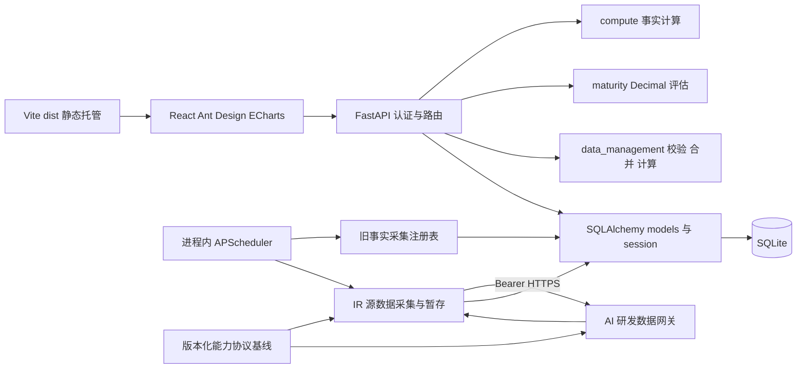

# Current Architecture

## 边界与技术栈

一个 React 19 客户端和一个 FastAPI 服务；Ant Design 提供 UI，ECharts 提供图表，React Router 管理页面。SQLAlchemy 2 管理默认 SQLite 存储，Pydantic 校验 HTTP DTO，APScheduler 3 在服务进程内调度。Radar 通过同步 HTTPX 客户端调用 AI 研发数据网关；Gateway 源码不在本仓库，当前实现仅覆盖 IR。双方共同依赖版本化能力协议，Radar Pydantic 模型只是消费端实现。

路由查询数据库后交给计算函数，不由图表决定统计口径。源数据 API 编排校验、权限和事务。旧事实采集仍走 FactRecord 注册表；IR 源采集由 `source_collection.py` 经 AI 研发数据网关单独执行并写入暂存批次，不触碰正式 IR 或旧事实链路。协议工作区保存最新完整基线和逐版本变化，消费者固定发布 tag 或 commit。图中的 Gateway 关系代表 Radar 侧实现，不代表真实内部平台联调已通过。

## 核心模块与依赖方向

| 模块 | 职责 | 约束 |
|---|---|---|
| `main.py` | 组装中间件、路由、lifespan、静态托管 | 启动和关闭调度器 |
| `auth.py` | session、密码及角色/团队权限 | 后端授权，每次加载用户 |
| `api.py` | 认证、目录、事实、成熟度 | 调用纯计算和 ORM |
| `data_api.py` | 组织、IR、批次、源数据指标 | 复用 data_management 规则 |
| `source_collection.py` / `collector_gateway.py` | IR 周期窗口、按团队运行、Gateway HTTPS 调用及暂存 | 同步调用；凭据只读环境变量；不自动重试 |
| `collector_contracts.py` | Gateway v1 严格 Pydantic 消费端模型 | 与版本化 OpenAPI 基线做一致性测试 |
| `ir_imports.py` | 文件导入与采集共用 IR 行校验及批次创建 | 采集批次必须绑定团队 |
| `compute.py` / `maturity.py` | 事实和评估计算 | 不依赖 HTTP 或数据库查询 |
| `data_management.py` | IR 规范化、解析、差异、合并和指标 | 不承担 HTTP 编排 |
| `models.py` / `db.py` / `migrations.py` | 实体、session、现有库增量 schema | 没有通用迁移框架 |
| `collectors.py` / `scheduler.py` | 接口注册和定时事实采集 | 没有真实平台实现 |

客户端共用 `api.js` 的 `fetchJson` 携带 cookie 和统一 HTTP 异常；领域页面拆出逻辑和图表配置。当前路径由 `routing/routeMetadata.js` 定义：`/`、`/analytics/activities`、`/analytics/capabilities`、`/analytics/teams/:teamId`、`/analytics/metrics/:metricId`、`/data/requirements/:requirementType`、`/data/maturity`、`/data/{issues|mr|code-review}`、`/settings/*`（含管理员 `/settings/collections`）；旧数据管理路径重定向到新分类，旧 `/?category=key|general` 重定向到活动/能力页。

AppShell 分别持有桌面折叠选择、matchMedia 窄屏状态与抽屉开关。localStorage 的 ai-dev-radar.sidebar-collapsed 只保存桌面布尔偏好；读取失败默认展开，写入失败不影响使用。监听 680px 断点，变化时关闭抽屉并恢复独立桌面选择。桌面 CSS 用同一自定义宽度变量同步 248px/64px 侧栏宽度与正文左偏移，并以 240ms cubic-bezier(.2,0,0,1) 过渡；首屏直接使用保存状态，连续切换由 CSS 从当前动画位置反向过渡，prefers-reduced-motion: reduce 时禁用新增过渡。

AppSidebar 的品牌区放共享的 frontend/public/favicon.svg 雷达 Logo 和折叠按钮：展开时水平分列，折叠后垂直居中；展开态使用 MenuFoldOutlined 收起侧栏，折叠态使用 MenuOutlined，按钮保留 Tooltip、ARIA 标签及键盘焦点反馈。按钮为 40×40px，hover 缩放 1.06、active 缩放 0.94，颜色/背景/缩放过渡 160ms；prefers-reduced-motion: reduce 时关闭按钮过渡和缩放。共享 SVG 为蓝色圆形雷达环、实色青色扫描线和三个数据点，供侧栏、抽屉、登录页和 favicon 使用。中间 app-nav 独立滚动，文字使用透明度与最大宽度裁切保持单行。窄屏使用现有 Ant Design Drawer，抽屉和侧栏共用 #F8FAFD 浅色表面，不保留折叠图标栏，关闭后焦点返回顶栏打开按钮。AppSidebar 复用角色过滤与路由元数据，数据管理直接提供四类来源链接，需求子路由共享所属入口样式；总览及其下钻同样使用所属入口样式，精确匹配才使用 aria-current=page。折叠切换不发业务请求、不改变权限。

`AnalyticsPages` 将研发总览、研发活动和研发能力拆成三个同级只读页面，以 `month` URL 参数作为共同分析月份。总览复用成熟度近六个月序列和团队整体趋势；活动页固定自然月窗口，能力页的原始指标按月/周/日窗口请求，成熟度不随粒度改变。`overviewLogic.js` 为选定月份生成以该月为终点的完整窗口，当前周期无事实时保留断点并显示空状态，不回退到最近事实。主体从每个指标的团队序列和 `company_average` 派生有效团队数、事实完整度、横向比较和 Signal，不使用 `domain_summary` 作为事实基线；不新增阈值、目标或外部基准。图表和 Signal 共用只读右侧 Drawer，成熟度写入集中在 `/data/maturity`。成熟度 overview 对选定月及前五个月并行读取现有 `/api/maturity/overview`，当前月响应继续作为维护与矩阵数据。成熟度仍使用后端领域平均；矩阵使用精确文本值、环比和微型趋势，并保留原生 `details/summary` 的团队比较与领域基线。布尔指标在保留跨月 `snapshot` 的同时使用已有 `series.values` 返回按月状态，保证月度选择不回退。

## 数据流和模型

事实链路：FactRecord → 当前有效事实选择 → 日/周/月或迭代切片 → 团队序列、全公司均值和领域合并值。日周期按 `Asia/Shanghai` 自然日生成，中间无事实日期保留为空周期。总览按月复用团队序列与 `company_average`，不把 `domain_summary` 当作展示基线。IR 链路：页面/文件或 Gateway → 共享行校验 → 带团队的临时批次 → 人工确认事务与审计 → 正式 IR → `/api/data-metrics/compute`。成熟度链路：团队月度维护 → MaturityRecord → Decimal 领域聚合。三者独立，IR 不自动替换看板事实。

团队产品层级支持源数据归属；人员关联责任工号。旧 ProductVersion 可无 product_id 是兼容形态，新管理版本必须绑定产品。更多模块细节见 [源数据模块](modules/data-management.md)。

## 运行与部署

lifespan 依次建表、增量 schema、检查活动目录并在为空时播种，确保 IR 默认禁用的调度配置存在，再加载启用的源数据调度任务并启动调度器；关闭时等待调度器退出。旧 `COLLECTION_CRON` 任务继续处理 FactRecord。播种是否执行由目录是否为空决定，不能据此宣称所有缺失数据都会自动补齐。

本地 Vite 将 `/api` 代理到 8000 后端。Docker 多阶段构建 Vite，FastAPI 同源托管 dist，以单个 Uvicorn 进程启动，SQLite 放在 `/data` 卷。SPA fallback 仅处理无扩展名 GET 客户端路径，显式排除 `/api`，保留 API 404/405 语义。Gateway base URL、Bearer Token 和超时由 `COLLECTOR_GATEWAY_URL`、`COLLECTOR_GATEWAY_TOKEN`、`COLLECTOR_GATEWAY_TIMEOUT_SECONDS` 提供；生产拒绝非 HTTPS URL。环境变量详见 [README](../../README.md)。

进程内调度约束意味着扩展多 worker 会重复调度；当前部署采用单进程。生产配置拒绝默认密钥和种子密码，HTTPS 场景需启用 secure cookie。Docker 镜像、卷重启持久化、MySQL 与真实内部平台/Gateway 联调本次未运行验证，不应宣称已验收。

侧栏与抽屉使用 #F8FAFD 浅色表面及 #E0E3E7 边框；正文文字为 #3C4043，辅助文字为 #5F6368，选中项使用 #D3E3FD 背景和深蓝文字。导航明确 overflow-x: hidden、overflow-y: auto，并允许网格及导航项收缩；折叠链接移除文字间距和横向留白，在最多 40px 的导航行内居中，避免横向滚动导致图标偏移。纵向使用细滚动条，短视口保持导航滚动能力，折叠控制固定在非滚动品牌区。
