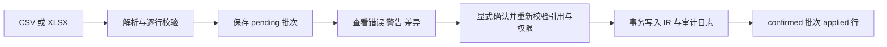

# 源数据、组织与权限管理

## 目标和范围

维护可追溯的研发源数据与 AI 属性，按定义实时计算指标。数据管理按需求、问题单、MR、代码检视四类业务数据源组织；IR、AR、SR 是需求内部分类。当前仅完整实现 IR，支持页面维护、文件导入及经 AI 研发数据网关暂存的采集；AR/SR 及其他数据源仍待定义。真实内部平台/Gateway 联调需部署环境另行验证。

## 组织和角色

归属链为团队 → 产品 → 产品版本 → 开发迭代期。IR 必须引用一致的产品、版本和迭代，团队沿产品归属。人员工号为稳定责任人标识；未匹配工号可入库并显示待匹配，不改变记录归属。

admin 管理全局配置和全部数据；maintainer 维护绑定团队数据；viewer 只读。不同列表的可见范围由后端接口分别控制，不能把导航隐藏当成授权。密码使用 Argon2，签名 cookie session 保存用户 ID；每次请求从数据库重新读取角色。

采集计划与手动触发仅限 admin。IR 采集批次由 admin 全局查看/确认；maintainer 只能查看/确认所属团队的采集批次。文件批次继续按原创建者权限查看/确认。

## 手工维护场景

需求工作台通过 IR、AR、SR 页签分类；页签路径可直接访问，未知分类回退 IR。IR 支持筛选、分页、新增和编辑；保存时校验业务字段、层级及权限。页面编辑可显式覆盖已有字段，正式数据变更写入 AuditLog，AI 属性另记字段级来源、维护人及时间。当前没有 IR 删除接口，AR/SR 没有数据表单。

## 文件导入流程

预览只写临时批次，不参与指标计算。任何无效行阻止整批确认；确认时重新验证引用和写权限。新需求编号新增记录；匹配正式需求编号只补空字段，已有值包括 false 和 0 保留。确认异常回滚整批；已确认批次再次确认返回冲突。未匹配责任人是警告，不是阻断错误。

## IR Gateway 采集

IR 采集由 Radar 按团队独立编排 AI 研发数据网关调用，但线协议不发送团队名称。Radar 根据团队版本配置与本地产品层级生成产品名称和版本名称组合；版本化能力协议是双方共同消费的实现中立事实源。Radar 负责调度、字段/层级校验、暂存、人工确认和审计，Gateway 负责内部平台认证、按产品版本组合查询和字段翻译。每个团队有独立运行结果和暂存批次，团队失败不会阻断其他团队；版本映射为空时跳过，Gateway 返回空结果时不创建空批次。

Gateway 同步返回最多 10000 行，窗口为带时区的半开区间 `[start_at, end_at)`。首版不分页、不异步轮询或自动重试；超限时管理员缩短窗口，失败按返回的 retryable 信息手动重跑。Radar 按产品名与版本名联合核对归属当前团队，再按该版本解析迭代名；响应超出请求产品版本范围时该行无效。Gateway 的 `business_module` 为 `null`、空字符串或纯空白时，Radar 在暂存前统一转换为 `通用模块`。任何无效行都阻止该团队批次整批确认。采集确认沿用导入的事务、只补空字段和 AI 字段来源记录，审计动作记为 `collector_confirm`。

调度按 `Asia/Shanghai` 配置为每小时、每日、每周或每月；IR 默认禁用。每小时、每日、每周和每月分别使用上一个完整小时、自然日、自然周和自然月。管理员可以不传窗口使用上一个完整配置周期，也可以手动指定带时区的合法窗口。

完整能力语义与线协议见 [AI 研发数据网关能力协议](../contracts/ai-dev-data-gateway/README.md)。Gateway 地址、Bearer Token 和超时只来自服务端环境变量，不进入数据库或前端；生产地址必须使用 HTTPS。

## 指标与数据边界

源数据指标定义指定数据域、类型、分子/分母字段和筛选；只计算有效正式 IR，结果不落库。可支持渗透率、效率、数量和比率，不能把事实目录的布尔能力推断为 IR 计算也已支持。工作台与旧 FactRecord 看板保持两条链路，统一适配尚未实现。

组织删除存在引用保护，不是统一软删除机制；具体实体需核对接口。种子重建为破坏性操作，不属于日常维护。

## 实现与相关决策

HTTP 编排见 `backend/app/data_api.py`，校验、文件解析和合并见 `data_management.py`，页面见 `frontend/src/dataManagement/` 和 `settings/`。规范前端入口为 `/data/requirements/{ir|ar|sr}`、`/data/issues`、`/data/mr` 和 `/data/code-review`；旧 IR/AR/SR/DTS/MR 路径重定向到新分类。验收用 `backend/tests/test_data_management.py` 及前端对应测试。

相关决策：[ADR-0003](../adr/0003-source-data-first-metrics.md)、[ADR-0004](../adr/0004-staged-import-and-field-merge.md)、[ADR-0005](../adr/0005-team-owned-product-hierarchy.md)、[ADR-0007](../adr/0007-business-source-navigation.md)、[ADR-0009](../adr/0009-versioned-ai-engineering-data-gateway-protocol.md)。详细实现见 [源数据模块](../architecture/modules/data-management.md)。
