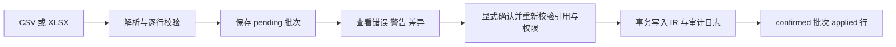

# 源数据、组织与权限管理

## 目标和范围

维护可追溯的研发源数据与 AI 属性，按定义实时计算指标。当前完整实现 IR；AR/SR/DTS/MR 入口不可操作，真实平台采集仅预留接口。系统管理包含团队/人员、产品/版本/迭代、指标定义及用户权限。

## 组织和角色

归属链为团队 → 产品 → 产品版本 → 开发迭代期。IR 必须引用一致的产品、版本和迭代，团队沿产品归属。人员工号为稳定责任人标识；未匹配工号可入库并显示待匹配，不改变记录归属。

admin 管理全局配置和全部数据；maintainer 维护绑定团队数据；viewer 只读。不同列表的可见范围由后端接口分别控制，不能把导航隐藏当成授权。密码使用 Argon2，签名 cookie session 保存用户 ID；每次请求从数据库重新读取角色。

## 手工维护场景

IR 支持筛选、分页、新增和编辑；保存时校验业务字段、层级及权限。页面编辑可显式覆盖已有字段，正式数据变更写入 AuditLog，AI 属性另记字段级来源、维护人及时间。当前没有 IR 删除接口。

## 文件导入流程

预览只写临时批次，不参与指标计算。任何无效行阻止整批确认；确认时重新验证引用和写权限。新需求编号新增记录；匹配正式需求编号只补空字段，已有值包括 false 和 0 保留。确认异常回滚整批；已确认批次再次确认返回冲突。未匹配责任人是警告，不是阻断错误。

## 指标与数据边界

源数据指标定义指定数据域、类型、分子/分母字段和筛选；只计算有效正式 IR，结果不落库。可支持渗透率、效率、数量和比率，不能把事实目录的布尔能力推断为 IR 计算也已支持。工作台与旧 FactRecord 看板保持两条链路，统一适配尚未实现。

组织删除存在引用保护，不是统一软删除机制；具体实体需核对接口。种子重建为破坏性操作，不属于日常维护。

## 实现与相关决策

HTTP 编排见 `backend/app/data_api.py`，校验、文件解析和合并见 `data_management.py`，页面见 `frontend/src/dataManagement/` 和 `settings/`。验收用 `backend/tests/test_data_management.py` 及前端对应测试。

相关决策：[ADR-0003](../adr/0003-source-data-first-metrics.md)、[ADR-0004](../adr/0004-staged-import-and-field-merge.md)、[ADR-0005](../adr/0005-team-owned-product-hierarchy.md)。详细实现见 [源数据模块](../architecture/modules/data-management.md)。
